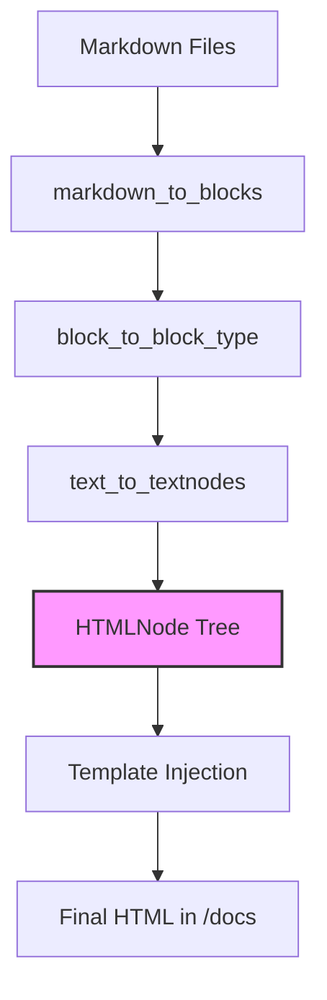

# Static Site Generator

A Python-based build tool that transforms a directory of Markdown files into a structured HTML website. This project focuses on the low-level implementation of a transformation pipeline, moving from raw text to structured objects, and finally to disk-backed HTML.

## 🏗 System Architecture

The project is divided into three distinct layers:

### 1. The Data Layer (`HTMLNode`)
The system uses a **Composite Design Pattern**, allowing the program to treat individual elements and nested structures uniformly:
- **`HTMLNode`**: The base class that defines the blueprint for all HTML elements.
- **`LeafNode`**: Represents elements that contain text but no nested children (e.g., `<b>`, `<i>`, or plain text).
- **`ParentNode`**: The backbone of the document structure. It handles the recursive nesting of elements—from small list items to the top-level `
` container—ensuring all tags are properly opened and closed.

### 2. The Parsing Layer (`block_to_html_node`)
The transformation follows a strict pipeline to convert Markdown into the Data Layer:
- **Block Splitter**: `markdown_to_blocks` segments the document by double newlines.
- **Type Classifier**: `block_to_block_type` uses pattern matching to identify structural elements like Code Blocks or Ordered Lists.
- **Inline Processor**: `text_to_textnodes` uses a multi-stage linear system and **Regular Expressions** to extract links and images.

### 3. The Orchestration Layer (`main.py`)
The logic that manages the file system:
- **`copy_dir_content`**: A recursive function that ensures the output directory is a clean, mirrored copy of the `/static` assets.
- **`generate_pages_recursive`**: Walks the `/content` tree, calculating paths and invoking the parser for every `.md` file found.

## 🛠 Project Data Flow

## 🧪 Testing & Reliability

The project is backed by a comprehensive suite of unit tests using the `unittest` framework. Key areas tested include:
- **Recursive HTML Rendering**: Validated through `test_to_html_with_greatgrandchildren`, ensuring that `ParentNode` correctly triggers the `to_html` methods of its children, regardless of depth.
- **Regex Extraction**: Verifying that `extract_markdown_links` and `extract_markdown_images` handle rogue brackets and edge cases.
- **Markdown Logic**: Testing that ordered lists only validate if they start with `1.` and increment correctly.

## 💻 How to Run

1. **Build and Preview**: Run `./main.sh` to generate the site and start a local server at `localhost:8888`.
2. **Production Build**: Run `./build.sh` to generate the site into the `/docs` folder (configured for GitHub Pages hosting).
3. **Run Tests**: Execute `./test.sh` to run the full validation suite.

---

### Technical Focus
This project avoids third-party libraries to demonstrate an understanding of **recursive file system operations**, **Regular Expression pattern matching**, and the **Composite Design Pattern**. By building the parser manually, the project ensures a lightweight, zero-dependency build process.